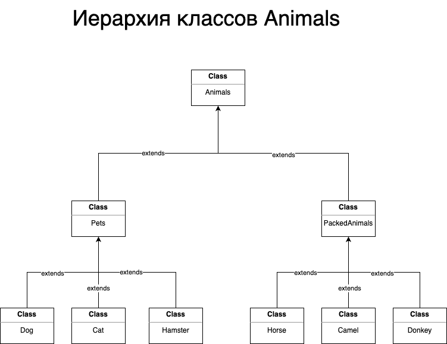

# Контрольная работа по блоку Специализация

## Информация о проекте
Необходимо организовать систему учета для питомника в котором живут
домашние и вьючные животные.

## Как сдавать проект:

Для сдачи проекта необходимо создать отдельный общедоступный
репозиторий(Github, gitlub, или Bitbucket). Разработку вести в этом
репозитории, использовать пул реквесты на изменения. Программа должна
запускаться и работать, ошибок при выполнении программы быть не должно.
Программа, может использоваться в различных системах, поэтому необходимо
разработать класс в виде конструктора

## Задание

1. Используя команду **cat** в терминале операционной системы Linux, создать
два файла Домашние животные (заполнив файл собаками, кошками,
хомяками) и Вьючные животными заполнив файл Лошадьми, верблюдами и
ослы), а затем объединить их. Просмотреть содержимое созданного файла.
Переименовать файл, дав ему новое имя (Друзья человека).


2. Создать директорию, переместить файл туда.

3. Подключить дополнительный репозиторий MySQL. Установить любой пакет
из этого репозитория.


4. Установить и удалить deb-пакет с помощью dpkg.


5. Выложить историю команд в терминале ubuntu
```bash
pwd
mkdir SpecializationControlWork
cd SpecializationControlWork/
cat > Pats
cat Pats 
cat > Pack_animals
cat Pack_animals 
cat Pats Pack_animals > Animals
cat Animals 
mv Animals Human_Friends
ls -li
mkdir Animals
mv Human_Friends Animals/
ls -li
ls -li Animals/
cd Downloads/
sudo wget https://dev.mysql.com/get/mysql-apt-config_0.8.27-1_all.deb
sudo dpkg -i mysql-apt-config_0.8.27-1_all.deb 
sudo apt update
sudo apt install mysql-server
sudo wget https://dl.google.com/linux/direct/google-chrome-stable_current_amd64.deb
sudo dpkg -i google-chrome-stable_current_amd64.deb 
sudo dpkg -r google-chrome-stable
```

6. Нарисовать диаграмму, в которой есть класс родительский класс, домашние
животные и вьючные животные, в составы которых в случае домашних
животных войдут классы: собаки, кошки, хомяки, а в класс вьючные животные
войдут: Лошади, верблюды и ослы).

Файл диаграммы [здесь](additional_files/HierarchyOfAnimalClasses.drawio).
7. В подключенном MySQL репозитории создать базу данных “Друзья
человека”
```SQL
-- Создать базу данных “Друзья человека”
CREATE DATABASE IF NOT EXISTS human_friends;
```
8. Создать таблицы с иерархией из диаграммы в БД
```SQL
-- Создать таблицы с иерархией из диаграммы в БД
USE Human_friends;

DROP TABLE IF EXISTS animals;
CREATE TABLE animals 
(
	id INT AUTO_INCREMENT PRIMARY KEY, 
	animal_type VARCHAR(45)
);
INSERT INTO animals (animal_type)
VALUES 
	('pets'),
	('packed_animals');

DROP TABLE IF EXISTS pets;
CREATE TABLE pets
(
	id INT AUTO_INCREMENT PRIMARY KEY,
    animal_kind VARCHAR (45),
    class_id INT,
    FOREIGN KEY (class_id) REFERENCES animals (id) ON DELETE CASCADE ON UPDATE CASCADE
);
INSERT INTO pets (animal_kind, class_id)
VALUES 
	('Dogs', 1),
	('Cats', 1),  
	('Hamsters', 1);

DROP TABLE IF EXISTS packed_animals;
CREATE TABLE packed_animals 
(
	id INT AUTO_INCREMENT PRIMARY KEY,
	animal_kind VARCHAR (45),
	class_id INT,
	FOREIGN KEY (class_id) REFERENCES animals (id) ON DELETE CASCADE ON UPDATE CASCADE
);
INSERT INTO packed_animals (animal_kind, class_id)
VALUES 
	('Horses', 2),
	('Camels', 2),  
	('Donkeys', 2); 
```
9. Заполнить низкоуровневые таблицы именами(животных), командами
которые они выполняют и датами рождения
```SQL
-- Заполнить низкоуровневые таблицы именами(животных), командами которые они выполняют и датами рождения    
DROP TABLE IF EXISTS dogs;
CREATE TABLE dogs 
(       
    id INT AUTO_INCREMENT PRIMARY KEY, 
    name VARCHAR(45), 
    birthday DATE,
    commands VARCHAR(75),
    animal_kind_id INT,
    FOREIGN KEY (animal_kind_id) REFERENCES pets (id) ON DELETE CASCADE ON UPDATE CASCADE
);
INSERT INTO dogs (name, birthday, commands, animal_kind_id)
VALUES 
	('Hunter', '2020-07-04', 'sit, stay', 1),
	('Bob', '2021-06-25', 'sit, lie, eat', 1),  
	('Lessy', '2019-03-21', 'crawl, sit, stay', 1), 
	('Poppy', '2022-05-16', 'bark, lie, sit', 1);

DROP TABLE IF EXISTS cats;
CREATE TABLE cats 
(       
    id INT AUTO_INCREMENT PRIMARY KEY, 
    name VARCHAR(45), 
    birthday DATE,
    commands VARCHAR(75),
    animal_kind_id INT,
    FOREIGN KEY (animal_kind_id) REFERENCES pets (id) ON DELETE CASCADE ON UPDATE CASCADE
);
INSERT INTO cats (name, birthday, commands, animal_kind_id)
VALUES 
	('Kitty', '2021-03-07', 'sit, lie', 2),
	('Snuffy', '2023-04-25', 'up, meow', 2),  
	('Puffy', '2017-01-01', 'play, meow', 2); 

DROP TABLE IF EXISTS hamsters;
CREATE TABLE hamsters 
(       
    id INT AUTO_INCREMENT PRIMARY KEY, 
    name VARCHAR(45), 
    birthday DATE,
    commands VARCHAR(75),
    animal_kind_id INT,
    FOREIGN KEY (animal_kind_id) REFERENCES pets (id) ON DELETE CASCADE ON UPDATE CASCADE
);
INSERT INTO hamsters (name, birthday, commands, animal_kind_id)
VALUES 
	('Hommych', '2022-01-01', 'play', 3),
	('Fluffy', '2021-03-19', 'eat', 3),  
	('Toothy', '2020-08-11', 'lie', 3);

DROP TABLE IF EXISTS horses;
CREATE TABLE horses 
(       
    id INT AUTO_INCREMENT PRIMARY KEY, 
    name VARCHAR(45), 
    birthday DATE,
    commands VARCHAR(75),
    animal_kind_id INT,
    FOREIGN KEY (animal_kind_id) REFERENCES packed_animals (id) ON DELETE CASCADE ON UPDATE CASCADE
);
INSERT INTO horses (name, birthday, commands, animal_kind_id)
VALUES 
	('Kurt', '2019-03-13', 'run, step, jump', 1),
	('Krispin', '2018-05-15', 'eat, jump', 1),  
	('Monty', '2019-07-21', 'prance, run, eat', 1), 
	('Red', '2021-12-10', 'stop, jump', 1);

DROP TABLE IF EXISTS camels;
CREATE TABLE camels 
(       
    id INT AUTO_INCREMENT PRIMARY KEY, 
    name VARCHAR(45), 
    birthday DATE,
    commands VARCHAR(75),
    animal_kind_id INT,
    FOREIGN KEY (animal_kind_id) REFERENCES packed_animals (id) ON DELETE CASCADE ON UPDATE CASCADE
);
INSERT INTO camels (name, birthday, commands, animal_kind_id)
VALUES 
	('Hillock', '2016-04-14', 'step, stop', 2),
	('Strong', '2018-03-12', 'run, eat', 2),  
	('Tramp', '2015-09-19', 'lie, step', 2);

DROP TABLE IF EXISTS donkeys;
CREATE TABLE donkeys 
(       
    id INT AUTO_INCREMENT PRIMARY KEY, 
    name VARCHAR(20), 
    birthday DATE,
    commands VARCHAR(50),
    animal_kind_id INT,
    FOREIGN KEY (animal_kind_id) REFERENCES packed_animals (id) ON DELETE CASCADE ON UPDATE CASCADE
);
INSERT INTO donkeys (name, birthday, commands, animal_kind_id)
VALUES 
	('Stubborn', '2018-03-11', 'stop, lie', 3),
	('Tyagun', '2020-03-02', 'eat', 3),  
	('Pusher', '2019-07-13', 'go, stop', 3), 
	('Baby', '2023-01-17', 'stop', 3);
```
10. Удалив из таблицы верблюдов, т.к. верблюдов решили перевезти в другой
питомник на зимовку. Объединить таблицы лошади, и ослы в одну таблицу.
```SQL
-- Удалив из таблицы верблюдов, т.к. верблюдов решили перевезти в другой питомник на зимовку. 
-- Объединить таблицы лошади, и ослы в одну таблицу.
SET SQL_SAFE_UPDATES = 0;
DELETE FROM camels;

DROP TABLE IF EXISTS horses_donkeys;
CREATE TABLE horses_donkeys
(       
    id INT AUTO_INCREMENT PRIMARY KEY, 
    name VARCHAR(45), 
    birthday DATE,
    commands VARCHAR(75),
    animal_kind_id INT,
    FOREIGN KEY (animal_kind_id) REFERENCES packed_animals (id) ON DELETE CASCADE ON UPDATE CASCADE
);
INSERT INTO horses_donkeys (name, birthday, commands, animal_kind_id)
	SELECT name, birthday, commands, animal_kind_id FROM horses
	UNION SELECT name, birthday, commands, animal_kind_id FROM donkeys;
```
11. Создать новую таблицу “молодые животные” в которую попадут все
животные старше 1 года, но младше 3 лет и в отдельном столбце с точностью
до месяца подсчитать возраст животных в новой таблице
```SQL
-- Создать новую таблицу “молодые животные” в которую попадут все животные старше 1 года, но младше 3 лет 
-- и в отдельном столбце с точностью до месяца подсчитать возраст животных в новой таблице
DROP TABLE IF EXISTS yang_animals;
CREATE TABLE yang_animals AS
	SELECT name, birthday, commands, animal_kind_id, TIMESTAMPDIFF(MONTH, birthday, CURDATE()) AS month_age
	FROM
		(	
			SELECT * FROM horses
			UNION SELECT * FROM donkeys
			UNION SELECT * FROM dogs
			UNION SELECT * FROM cats
			UNION SELECT * FROM hamsters
		) AS all_animals
	WHERE birthday BETWEEN ADDDATE(curdate(), INTERVAL -3 YEAR) AND ADDDATE(CURDATE(), INTERVAL -1 YEAR);
```
12. Объединить все таблицы в одну, при этом сохраняя поля, указывающие на
прошлую принадлежность к старым таблицам.
```SQL
-- Объединить все таблицы в одну, при этом сохраняя поля, указывающие на прошлую принадлежность к старым таблицам.
DROP TABLE IF EXISTS animals_report;
CREATE TABLE animals_report AS
	SELECT h.name, h.birthday, h.commands, pck.animal_kind, yng.month_age 
	FROM horses h
		LEFT JOIN yang_animals yng ON yng.name = h.name
		LEFT JOIN packed_animals pck ON pck.id = h.animal_kind_id
	UNION 
	SELECT d.name, d.birthday, d.commands, pck.animal_kind, yng.month_age 
	FROM donkeys d 
		LEFT JOIN yang_animals yng ON yng.name = d.name
		LEFT JOIN packed_animals pck ON pck.id = d.animal_kind_id
	UNION
	SELECT c.name, c.birthday, c.commands, p.animal_kind, yng.month_age 
	FROM cats c
		LEFT JOIN yang_animals yng ON yng.name = c.name
		LEFT JOIN pets p ON p.id = c.animal_kind_id
	UNION
	SELECT dg.name, dg.birthday, dg.commands, p.animal_kind, yng.month_age 
	FROM dogs dg
		LEFT JOIN yang_animals yng ON yng.name = dg.name
		LEFT JOIN pets p ON p.id = dg.animal_kind_id
	UNION
	SELECT hm.name, hm.birthday, hm.commands, p.animal_kind, yng.month_age 
	FROM hamsters hm
		LEFT JOIN yang_animals yng ON yng.name = hm.name
		LEFT JOIN pets p ON p.id = hm.animal_kind_id;
```
Файл SQL-скрипта [здесь](additional_files/human_friends.sql).

13. Создать класс с Инкапсуляцией методов и наследованием по диаграмме.
Класс реализован [здесь](HumanFriends/src/main/java/model/pets).
14. Написать программу, имитирующую работу реестра домашних животных.
В программе должен быть реализован следующий функционал:
    1. Завести новое животное
    2. определять животное в правильный класс
    3. увидеть список команд, которое выполняет животное
    4. обучить животное новым командам
    5. Реализовать навигацию по меню

Приложение на Java [здесь](HumanFriends/src/main/java).

15. Создайте класс Счетчик, у которого есть метод add(), увеличивающий̆
значение внутренней̆int переменной̆на 1 при нажатие “Завести новое
животное” Сделайте так, чтобы с объектом такого типа можно было работать в
блоке try-with-resources. Нужно бросить исключение, если работа с объектом
типа счетчик была не в ресурсном try и/или ресурс остался открыт. Значение
считать в ресурсе try, если при заведения животного заполнены все поля.

Класс реализован [здесь](HumanFriends/src/main/java/model/petsRegistry/Counter.java).